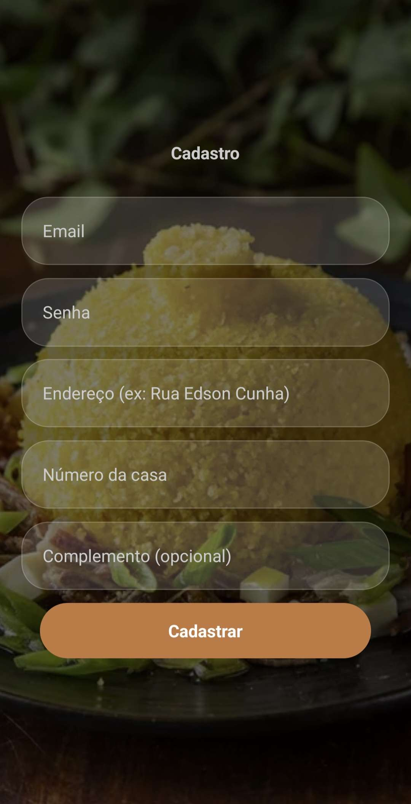
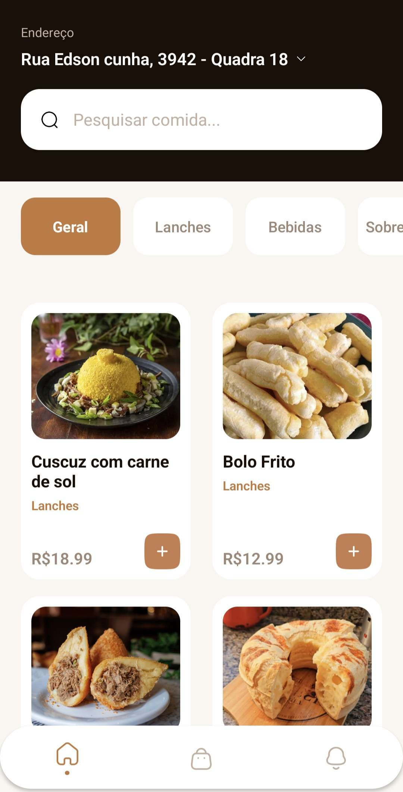
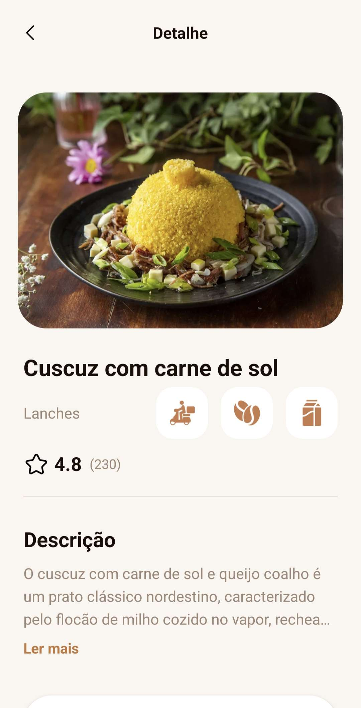
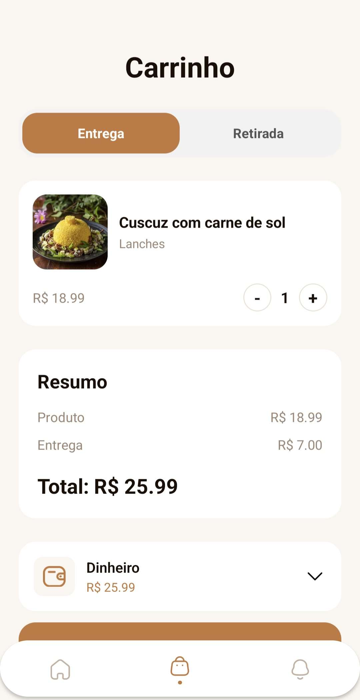
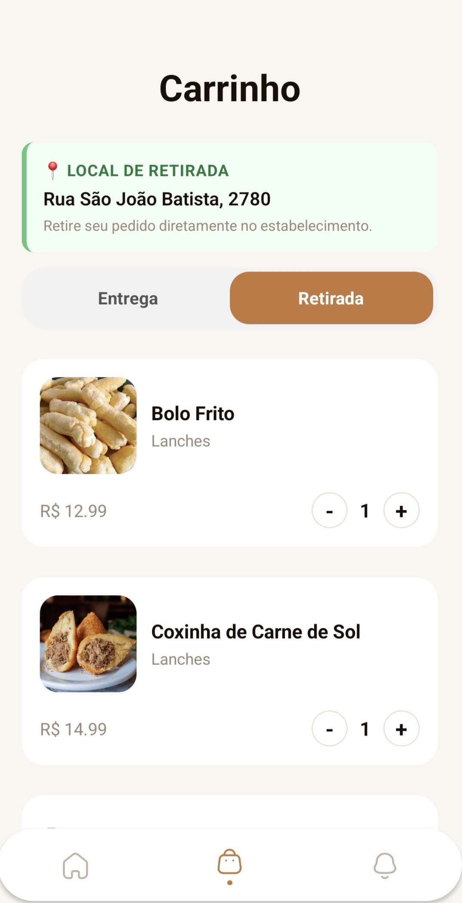
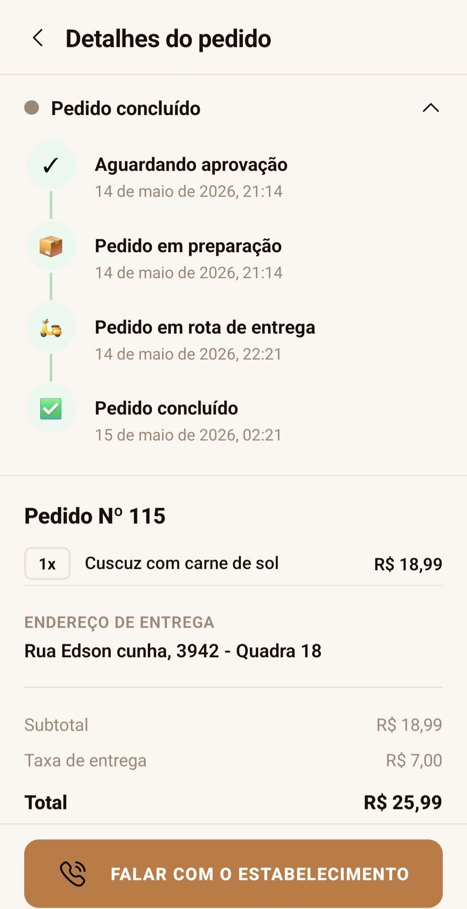
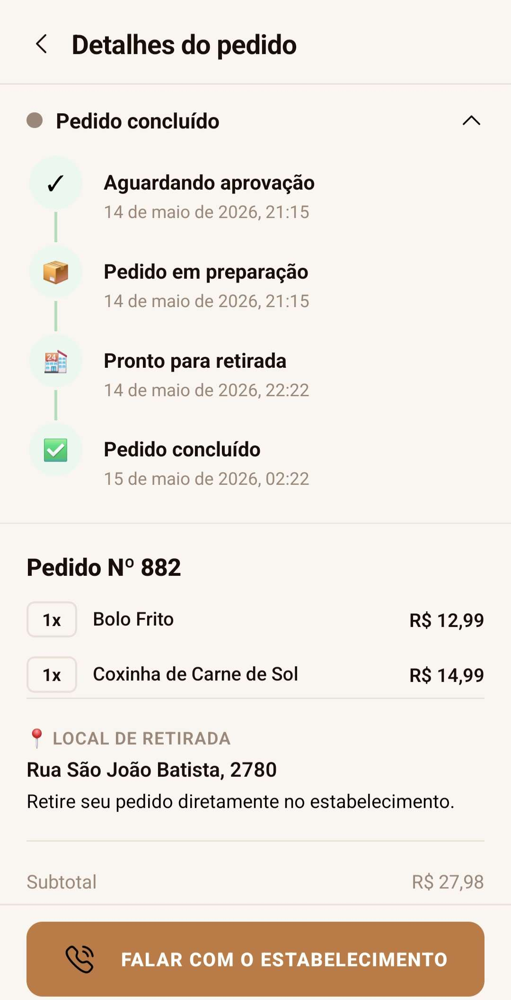

# Desenvolvedores

* Dhallyson Breno Carvalho da Silva - 01797597
* Joanne Alexandrino Floriano de Oliveira - 01800675
* Raphael Pereira da Silva - 01797315
* Victor Davi Costa Amaral e Sousa - 01800467

---

# App de Comidas Brasileiras

Um aplicativo mobile desenvolvido com React Native e Expo Router, criado com o objetivo de apresentar pratos típicos nordestinos através de uma experiência moderna, visualmente agradável e totalmente responsiva.

O projeto foi pensado para unir cultura brasileira e design mobile em um único aplicativo, simulando a experiência de aplicativos reais de delivery e catálogo gastronômico.

---

# Visão Geral do Projeto

O App de Comidas Brasileiras é um catálogo interativo de comidas típicas nacionais.

A aplicação permite que o usuário navegue por diferentes pratos, visualize imagens, preços, avaliações e descrições detalhadas, além de interagir com a interface de forma intuitiva.

O foco principal do projeto foi:

* Desenvolver uma interface moderna
* Trabalhar conceitos fundamentais de React Native
* Organizar componentes e estruturas de maneira escalável
* Implementar responsividade
* Trabalhar navegação dinâmica entre telas

---

# Objetivo do Aplicativo

O aplicativo foi desenvolvido para representar pratos tradicionais brasileiros de maneira visual e interativa.
Além do foco em programação mobile, o projeto também busca valorizar elementos da culinária brasileira, utilizando:

* Comidas e bebidas regionais
* Elementos visuais inspirados na cultura nordestina

---

# Funcionalidades Implementadas

O aplicativo possui diversas telas e funcionalidades que trabalham juntas para criar uma experiência moderna, intuitiva e responsiva para o usuário.

---

# Como Executar o Projeto

## 1. Clonar o Repositório
```bash
git clone https://github.com/Dhallyson0/App-de-comidas-brasileiras.git
```

---

## 2. Entrar na Pasta
```bash
cd App-de-comidas-brasileiras
```

---

## Instalação Completa das Dependências
Após clonar o projeto, execute o comando abaixo para instalar todas as dependências automaticamente:

```bash
npm install
```

Esse comando irá instalar todas as bibliotecas necessárias listadas no arquivo `package.json`, incluindo:

* Expo
* React Native
* Expo Router
* Firebase
* React Navigation
* React Native Reanimated
* Expo Image
* Expo Splash Screen
* Entre outras dependências utilizadas no projeto.


## Executando o Projeto
Após instalar as dependências, inicie o projeto com:

```bash
npx expo start
```

Depois disso:

* Pressione `a` para abrir no Android
* Pressione `w` para abrir no navegador
* Escaneie o QR Code com o aplicativo Expo Go

---

## Tela de Cadastro - Victor Davi e Dhallyson

A tela inicial foi desenvolvida para causar uma boa primeira impressão ao usuário, utilizando um design moderno e visualmente agradável.

Nela foram implementados:

* Imagem de fundo em tela cheia
* Overlay escuro para melhorar a visibilidade dos textos
* Título principal estilizado
* Subtítulo descritivo
* Botão de entrada para acessar o aplicativo
* Centralização responsiva dos elementos
* Estrutura adaptada para diferentes tamanhos de tela

Essa tela funciona como porta de entrada do aplicativo.

---

## Tela Home - Joanne

A tela Home é responsável por exibir os produtos disponíveis no aplicativo.

Nela o usuário pode:

* Visualizar os pratos cadastrados
* Navegar entre diferentes categorias
* Ver imagens dos produtos
* Consultar nome e preço dos pratos
* Selecionar um item específico
* Acessar a tela de detalhes do produto

Funcionalidades utilizadas:

* Renderização dinâmica com array
* Listagem de produtos
* Componentização
* Navegação dinâmica com Expo Router
* Organização visual em cards

---

## Tela de Detalhes - Victor Davi

A tela de detalhes foi criada para apresentar informações completas sobre o produto selecionado.

Ela possui:

* Header superior personalizado
* Botão de voltar
* Título da página
* Ícone de favorito
* Imagem destacada do produto
* Nome do prato
* Categoria do produto
* Sistema de avaliações
* Nota e quantidade de avaliações
* Preço destacado
* Descrição detalhada
* Sistema “Ler mais”
* Botão de retorno

 ---

## Tela de Carrinho - Raphael
A tela de carrinho foi desenvolvida para permitir que o usuário visualize os produtos adicionados antes da finalização do pedido. Nela é possível:

* Visualizar os produtos selecionados
* Consultar informações do pedido
* Ver imagens dos produtos
* Conferir preços individuais
* Visualizar o valor total da compra
* Navegar de forma organizada entre os itens

A interface foi construída com foco em praticidade e organização visual, simulando o funcionamento de aplicativos reais de delivery.

 ---
## Tela de Delivery - Dhallyson
A tela de delivery foi criada para representar a etapa de entrega do pedido. Ela possui funcionalidades visuais relacionadas ao acompanhamento do pedido e experiência de entrega. Entre os elementos presentes estão:

* Informações de entrega
* Dados do pedido
* Layout moderno e responsivo
* Organização visual semelhante a aplicativos reais
* Interface focada na experiência do usuário

Essa tela complementa o fluxo do aplicativo, tornando a navegação mais completa e imersiva. 

 ---

## Sistema de Navegação

O aplicativo utiliza o Expo Router para realizar a navegação dinâmica entre as telas.

O usuário pode:

* Sair da tela inicial
* Entrar na Home
* Selecionar produtos
* Navegar para os detalhes
* Retornar para páginas anteriores

A navegação foi organizada de forma simples e intuitiva.

---

## Sistema de Produtos Dinâmicos

Todos os produtos do aplicativo são carregados através de um array centralizado.

Cada item possui:

* ID
* Nome
* Categoria
* Preço
* Descrição
* Imagem

Esse sistema facilita:

* Escalabilidade do projeto
* Adição de novos produtos
* Organização dos dados
* Reutilização de componentes

---

## Responsividade

O aplicativo foi adaptado para diferentes tamanhos de tela.

Foram utilizados recursos como:

* Flexbox
* Width em porcentagem
* AlignSelf
* Espaçamentos responsivos
* ScrollView
* Estrutura flexível

Isso garante melhor experiência em diferentes dispositivos móveis. 

---

# Design e Interface
Toda a identidade visual foi construída utilizando como referência o layout “Coffee Shop Mobile App Design”, desenvolvido por Bony Fasius Gultom e disponibilizado pelo professor como base visual. O modelo foi adaptado para atender às necessidades do projeto, mantendo características de design moderno e intuitivo. Entre os aspectos utilizados como inspiração estão:
*Organização limpa dos elementos na tela
*Hierarquia visual bem definida
*Uso de espaçamentos para melhorar a leitura
*Destaque para imagens e produtos
*Navegação simples e acessível
*Estilo moderno focado na experiência do usuário

---

# Arquitetura do Projeto

A estrutura do projeto foi organizada visando clareza e escalabilidade.

```bash
src/
 ├── app/
 │    ├── (protected)/
 │    │    ├── (tabs)/
 │    │    ├── [orderId].jsx
 │    │    └── itemDetail.jsx
 │    ├── login.jsx
 │    └── signUp.jsx
 │
 ├── assets/
 │    ├── icons/
 │    └── images/
 │
 ├── components/
 │
 ├── config/
 │
 ├── context/
 │
 └── styles/
```

---

# Explicação da Estrutura

## app/
Responsável pelas telas da aplicação.

### index.tsx
Tela inicial do aplicativo, responsável pela listagem dos produtos.

---

## components/
Contém arquivos reutilizáveis.

### tabelaprodutos.js
Array principal contendo todos os produtos da aplicação.

---

## config/
Contém arquivos do banco de dados firebase

### firebase.js
é a conexão com banco de dados com o .env

---

## context/
Contém arquivos dos contexto do app, como carrinho e usuario.

---

## styles/
Responsável pelas constantes globais do projeto.

### globalStyle.js
Contém:

* Cores globais
* Sistema visual
* Padronização da interface

---

## assets/
Armazena arquivos visuais.

### images/
Imagens dos pratos.

### icons/
Ícones PNG personalizados.

---

# Banco de Dados
O banco de dados utiliza o Firebase e sua configuração está localizada na pasta config, no arquivo firebase.js. Esse arquivo é responsável por importar as informações armazenadas no arquivo .env, permitindo a configuração e o funcionamento correto do banco de dados.
O arquivo firebase.js utiliza as seguintes variáveis do ambiente:
* apiKey
* authDomain
* projectId
* storageBucket
* messagingSenderId
* appId
* measurementId
O banco de dados possui os seguintes campos:
* email
* senha
* localizacao
* numeroResidencial
* complemento
* criadoEm (utilizado para registrar a data e o horário de criação da conta)

---

# Conceitos Trabalhados

Durante o desenvolvimento foram aplicados diversos conceitos importantes:

* Componentização
* Navegação dinâmica
* Organização de pastas
* Props
* Estados com useState
* Renderização dinâmica
* Listagem com map
* Responsividade
* ScrollView
* Sistema de temas
* Importação de imagens locais
* Estilização avançada
* Estrutura de aplicativos React Native

## Dependências Instaladas

```json 
{
"dependencies": {
"@react-navigation/bottom-tabs": "^7.4.0",
"@react-navigation/elements": "^2.6.3",
"@react-navigation/native": "^7.1.8",
"@react-navigation/native-stack": "^7.14.12",
"expo": "~54.0.33",
"expo-constants": "~18.0.13",
"expo-font": "~14.0.11",
"expo-image": "~3.0.11",
"expo-linking": "~8.0.11",
"expo-navigation-bar": "~5.0.10",
"expo-router": "~6.0.23",
"expo-splash-screen": "~31.0.13",
"expo-status-bar": "~3.0.9",
"expo-system-ui": "~6.0.9",
"expo-web-browser": "~15.0.10",
"firebase": "^12.13.0",
"react": "19.1.0",
"react-dom": "19.1.0",
"react-native": "0.81.5",
"react-native-gesture-handler": "~2.28.0",
"react-native-keyboard-aware-scroll-view": "^0.9.5",
"react-native-reanimated": "~4.1.1",
"react-native-safe-area-context": "~5.6.0",
"react-native-screens": "~4.16.0",
"react-native-web": "~0.21.0",
"react-native-worklets": "0.5.1"
} 
}
```

---

# Imagens das telas

## Autenticação

<table>
  <tr>
    <td align="center">
      <h3>Login</h3>
      
    </td>
    <td align="center">
      <h3>Cadastro</h3>
      
    </td>
  </tr>
</table>

---

## Tela Inicial

<div align="center">
  
</div>

---

## Detalhes do Item

<div align="center">
  
</div>

---

## Carrinho

<table>
  <tr>
    <td align="center">
      <h3>Entrega</h3>
      
    </td>
    <td align="center">
      <h3>Retirada</h3>
      
    </td>
  </tr>
</table>

---

## Pedidos

<div align="center">
  
</div>

---

## Detalhes dos Pedidos

<table>
  <tr>
    <td align="center">
      <h3>Pedido - Entrega</h3>
      
    </td>
    <td align="center">
      <h3>Pedido - Retirada</h3>
      
    </td>
  </tr>
</table>